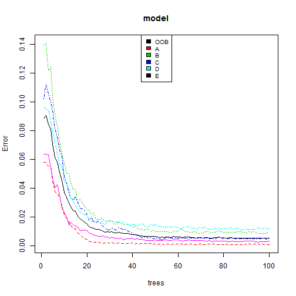
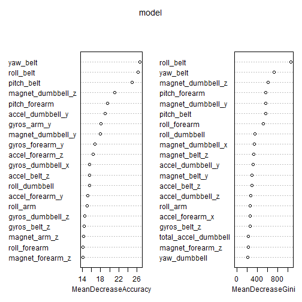

This is an R Markdown document. Markdown is a simple formatting syntax for authoring HTML, PDF, and MS Word documents. For more details on using R Markdown see <http://rmarkdown.rstudio.com>.

When you click the **Knit** button a document will be generated that includes both content as well as the output of any embedded R code chunks within the document. You can embed an R code chunk like this:

# Background

Using devices such as Jawbone Up, Nike FuelBand, and Fitbit it is now possible to collect a large amount of data about personal activity relatively inexpensively. These type of devices are part of the quantified self movement - a group of enthusiasts who take measurements about themselves regularly to improve their health, to find patterns in their behavior, or because they are tech geeks. One thing that people regularly do is quantify how much of a particular activity they do, but they rarely quantify how well they do it. In this project, your goal will be to use data from accelerometers on the belt, forearm, arm, and dumbell of 6 participants. They were asked to perform barbell lifts correctly and incorrectly in 5 different ways. More information is available from the website here: http://groupware.les.inf.puc-rio.br/har (see the section on the Weight Lifting Exercise Dataset). 


##Data 

The training data for this project are available here: 

https://d396qusza40orc.cloudfront.net/predmachlearn/pml-training.csv

The test data are available here: 

https://d396qusza40orc.cloudfront.net/predmachlearn/pml-testing.csv

The data for this project come from this source: http://groupware.les.inf.puc-rio.br/har. If you use the document you create for this class for any purpose please cite them as they have been very generous in allowing their data to be used for this kind of assignment. 

## Analysis

### Loading the given training dataset

```r
setwd("C:/Users/Ramesh Annam - PKO/R-training/ML")
training_given <- read.csv("pml-training.csv")
```

* Note - initially a model(using rpart and random forest as well) was built using 
only 4 variables as predictors for Classe output variable. These 4 predictors were selected using their high correlation to the
response variable. But the prediction accuracy was very poor. So planned to include
more variables after some cleanup as below. 

* As shown below - First we are checking for numeric columns and also making sure to 
eliminate columns with totals as NAs (before calculating the totals we are converting the
factors to numeric)

* Below code will show two warning messages related to the sum of NAs in data, 
which are fine as we are doing this to flag and filter the data anyway

### Selection of required fields/ predictor variables

```r
valid_sum_flag <- matrix(nrow = 160,ncol=2)
for (i in 1:160){
        valid_sum_flag[i,1] <- is.numeric(training_given[,i])
        if (class(training_given[,i])=="factor"){
                training_given[,i] <- as.numeric(training_given[,i])
        }
        
        valid_sum_flag[i,2] <- sum(training_given[,i])
        
}
```

```
## Warning in sum(training_given[, i]): integer overflow - use
## sum(as.numeric(.))
```

```
## Warning in sum(training_given[, i]): integer overflow - use
## sum(as.numeric(.))
```

* We are now selecting only columns as predictors where the colum sum is not NA
and the column is numeric


```r
valid_columns <- (!is.na(valid_sum_flag[,2]) & valid_sum_flag[,1]==TRUE)
```

* Now select the required columns (selected above) from the given training dataset.
And reattach the classe variable (as labeled factors). Also removing two more
unnecessary variables.


```r
train_given_filtered <- training_given[,valid_columns]

training_given <- read.csv("pml-training.csv")
train_given_filtered$classe <- training_given$classe

train_given_filtered <- train_given_filtered[,-c(1,2)]
```


### Data partitioning - training and testing (on given training dataset)
* Now from the above filtered given training set, split the data again into
training and test datasets - as we can use test for cross validation


```r
library(caret)
```

```
## Loading required package: lattice
## Loading required package: ggplot2
```

```r
set.seed(32323)
inTrain  <- createDataPartition(y=train_given_filtered$classe, p=0.80, list = FALSE)
training <- train_given_filtered[inTrain,]
testing  <- train_given_filtered[-inTrain,]
```

### Model development
* Now building the model with training dataset using RandomForest


```r
library(randomForest)
```

```
## Warning: package 'randomForest' was built under R version 3.2.1
```

```
## randomForest 4.6-10
## Type rfNews() to see new features/changes/bug fixes.
```

```r
model <- randomForest(classe ~ ., data = training, ntree=100, importance=TRUE)
model
```

```
## 
## Call:
##  randomForest(formula = classe ~ ., data = training, ntree = 100,      importance = TRUE) 
##                Type of random forest: classification
##                      Number of trees: 100
## No. of variables tried at each split: 7
## 
##         OOB estimate of  error rate: 0.54%
## Confusion matrix:
##      A    B    C    D    E  class.error
## A 4460    4    0    0    0 0.0008960573
## B   17 3011   10    0    0 0.0088874259
## C    0    9 2724    5    0 0.0051132213
## D    0    0   28 2542    3 0.0120481928
## E    0    1    3    5 2877 0.0031185031
```

* As shown above though the OOB is given as 54%, the confusion matrix shows decent results
along the diagonal mostly

### Error rates and important variables
* Now plotting the error rates, we see that as the tree reaches 40+ error rate saturates 
with not much further improvement


```r
library(randomForest)
plot(model)
legend("top", colnames(model$err.rate), col=1:5, cex=0.8, fill=1:5)
```

 


```r
varImpPlot(model, sort=TRUE, n.var=min(20, nrow(model$importance)))
```

 

* This plot shows the importance of the variables.

### Prediction on test dataset (from given training - subset)
* Now using the above model, to make prediction on the test dataset (from given training set)


```r
library(caret)
prediction <- predict(model, newdata=testing, type = "class")
confusionMatrix(prediction, testing$classe)
```

```
## Confusion Matrix and Statistics
## 
##           Reference
## Prediction    A    B    C    D    E
##          A 1115    4    0    0    0
##          B    1  754    3    0    0
##          C    0    1  681    9    0
##          D    0    0    0  634    0
##          E    0    0    0    0  721
## 
## Overall Statistics
##                                           
##                Accuracy : 0.9954          
##                  95% CI : (0.9928, 0.9973)
##     No Information Rate : 0.2845          
##     P-Value [Acc > NIR] : < 2.2e-16       
##                                           
##                   Kappa : 0.9942          
##  Mcnemar's Test P-Value : NA              
## 
## Statistics by Class:
## 
##                      Class: A Class: B Class: C Class: D Class: E
## Sensitivity            0.9991   0.9934   0.9956   0.9860   1.0000
## Specificity            0.9986   0.9987   0.9969   1.0000   1.0000
## Pos Pred Value         0.9964   0.9947   0.9855   1.0000   1.0000
## Neg Pred Value         0.9996   0.9984   0.9991   0.9973   1.0000
## Prevalence             0.2845   0.1935   0.1744   0.1639   0.1838
## Detection Rate         0.2842   0.1922   0.1736   0.1616   0.1838
## Detection Prevalence   0.2852   0.1932   0.1761   0.1616   0.1838
## Balanced Accuracy      0.9988   0.9961   0.9963   0.9930   1.0000
```

* From above confusionMatrix, the accuracy is shown as 0.99. And the matrix shows most of the matches on the diagonal. Seems to be very good match.

### Final prediction on the GIVEN test dataset
* Now applying the above model on the given actual test dataset.
Also we are again filtering on the selected valid columns above.
Prediction variable shows the final outcome.


```r
test_given <- read.csv("pml-testing.csv")
test_given_filtered <- test_given[,valid_columns]
test_given_filtered <- test_given_filtered[,-c(1,2)]
prediction2 <- predict(model, newdata=test_given_filtered, type = "class")
prediction2
```

```
##  1  2  3  4  5  6  7  8  9 10 11 12 13 14 15 16 17 18 19 20 
##  B  A  B  A  A  E  D  B  A  A  B  C  B  A  E  E  A  B  B  B 
## Levels: A B C D E
```


* Using the above result and also given file generation code,
we can create the 20 output files required for project submission 
for automated grading. And secured 20 points successfully on the automated grading :)


```r
pml_write_files = function(x){
        n = length(x)
        for(i in 1:n){
                filename = paste0("problem_id_",i,".txt")
                write.table(x[i],file=filename,quote=FALSE,row.names=FALSE,col.names=FALSE)
        }
}

pml_write_files(prediction2)
```
